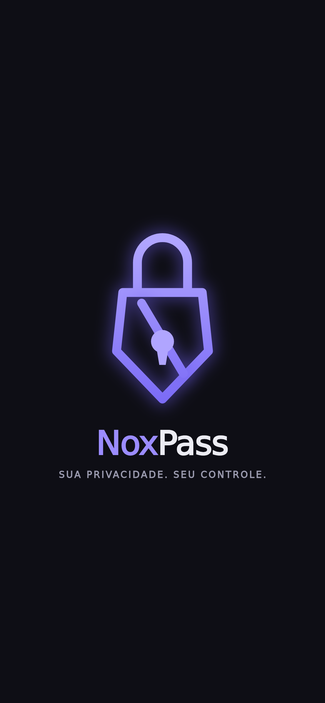
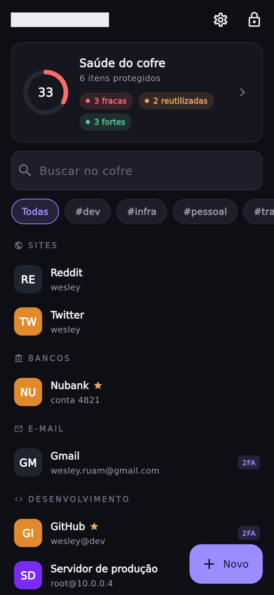
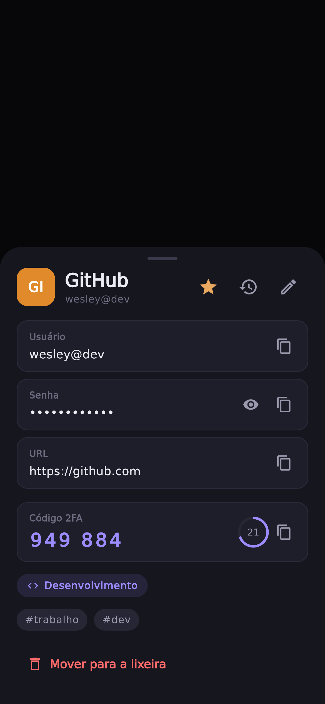
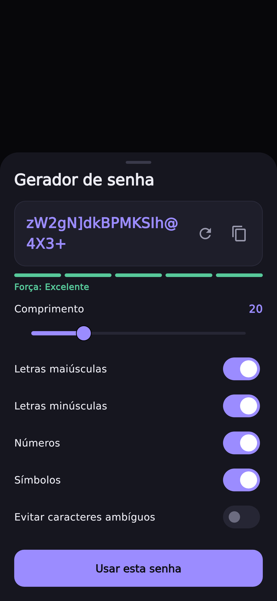
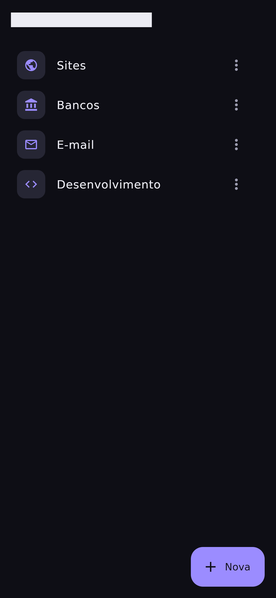
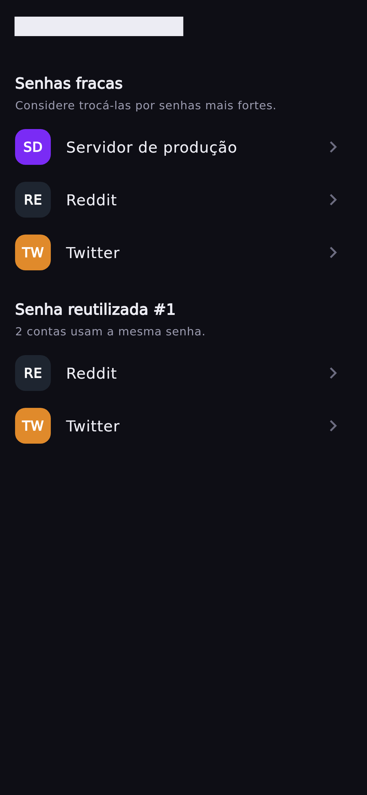

<div align="center">

# 🛡️ NoxPass

**Sua privacidade. Seu controle. Suas senhas.**

Gerenciador de senhas e segredos (Secrets Manager) moderno — *Offline-First*, *Zero-Knowledge*, construído com Flutter.

</div>

---

## 📱 Telas

<table>
  <tr>
    <td align="center"></td>
    <td align="center"></td>
    <td align="center"></td>
  </tr>
  <tr>
    <td align="center"><sub><b>Abertura animada</b><br>logo construída em vetor</sub></td>
    <td align="center"><sub><b>Cofre</b><br>agrupado por categoria, com tags e busca</sub></td>
    <td align="center"><sub><b>Detalhe</b><br>campos em mono, 2FA (TOTP) ao vivo</sub></td>
  </tr>
  <tr>
    <td align="center"></td>
    <td align="center"></td>
    <td align="center"></td>
  </tr>
  <tr>
    <td align="center"><sub><b>Gerador</b><br>comprimento e classes de caracteres</sub></td>
    <td align="center"><sub><b>Categorias</b><br>criar, renomear e excluir</sub></td>
    <td align="center"><sub><b>Saúde do cofre</b><br>senhas fracas e reutilizadas</sub></td>
  </tr>
</table>

> Capturas com **dados fictícios**, geradas de forma reproduzível e headless (sem dispositivo) via `tool/screenshots/` — ver [Gerando as screenshots](#gerando-as-screenshots).

---

## Filosofia

- **Offline First** — o app funciona 100% sem internet; nuvem é opcional.
- **Zero-Knowledge** — o servidor nunca consegue descriptografar nada. Só o usuário conhece a senha mestra.
- **Privacy & Security by Design** — dados sensíveis vivem em memória pelo menor tempo possível; nada de segredos em log.
- **Clean Architecture**, SOLID, DRY, KISS — módulos independentes, preparados para crescer sem grandes refatorações.

## Arquitetura de criptografia

A senha mestra **nunca** é usada diretamente como chave. Toda a proteção parte de uma hierarquia de chaves com *envelope encryption*:

```
Senha Mestra ──Argon2id──▶ Master Key (KEK, nunca persistida)
                                │  AES-256-GCM (embrulha)
                                ▼
                         DEK aleatória (256 bits)
                                │  HKDF-SHA256 (separação de domínio)
                    ┌───────────┴───────────┐
               databaseKey               fieldKey
              (SQLCipher, DB           (envelope por campo,
               inteiro em repouso)      AES-256-GCM por segredo)
```

- **KDF**: Argon2id (RFC 9106), salt aleatório por cofre.
- **Cifragem**: AES-256-GCM com nonce aleatório e único por operação (nunca reutilizado), integridade sempre verificada.
- **Repouso**: SQLCipher no banco inteiro **+ envelope por campo** (defesa em profundidade).
- **Troca de senha mestra**: re-embrulha só a DEK — o cofre não é recifrado.

## Stack

Flutter · Material 3 · Riverpod · GoRouter · Drift + SQLCipher · freezed · `cryptography` / `cryptography_flutter` · `flutter_secure_storage` · `local_auth`

## Estrutura

```
lib/
├── core/        # infra transversal (crypto, database, di)
├── features/    # módulos por funcionalidade (domain/data/presentation)
├── shared/      # tema, widgets reutilizáveis
└── routes/      # GoRouter
```

## Status

🚧 Em desenvolvimento ativo. Concluído até aqui:

- [x] Scaffold multiplataforma (Android, iOS, Linux, macOS, Windows)
- [x] Camada de criptografia completa, com testes unitários
- [x] Tema M3 (claro/escuro), rotas e injeção de dependência
- [x] Banco Drift + SQLCipher (envelope por campo, lixeira e histórico)
- [x] Onboarding (senha mestra), lock/unlock e CRUD do cofre na UI
- [x] Auto-lock, dashboard de segurança, backup (export/import) e lixeira/histórico
- [x] Desbloqueio rápido por PIN e biometria, com proteção contra força bruta
- [x] Autenticador TOTP embutido (2FA), validado contra a RFC 6238
- [x] Categorias e tags (agrupar, filtrar, gerir) e busca por título/usuário/URL
- [x] Gerador de senhas com controles (comprimento, classes, evitar ambíguos)
- [x] Favoritos e troca da senha mestra (re-embrulha a DEK, sem recifrar)
- [x] Identidade visual "Cofre à noite" + abertura com logo animada (vetorial)
- [x] Bloqueio de captura de tela no Android (`FLAG_SECURE`)
- [ ] Passkeys, sincronização e importadores (Bitwarden/KeePass/CSV)

## Rodando

```bash
flutter pub get
dart run build_runner build --delete-conflicting-outputs   # gera o código do Drift
flutter test      # roda a suíte (criptografia + banco/repositório)
flutter run
```

> O código gerado (`*.g.dart`) não é versionado — rode o `build_runner` após clonar.

### Gerando as screenshots

As imagens de `docs/screenshots/` são renderizadas de forma **headless** (via *golden tests*), com **dados fictícios** — sem dispositivo e sem expor nenhum cofre real:

```bash
flutter test --update-goldens tool/screenshots/generate_screenshots.dart
```

Fica fora da suíte padrão (em `tool/`, não em `test/`), então não interfere no `flutter test`. Requer as fontes DejaVu instaladas no sistema.

## Roadmap

| Versão | Escopo |
|--------|--------|
| **MVP** | Senha mestra, criptografia, CRUD, pesquisa, categorias, favoritos, backup |
| **1.1** | Histórico, compartilhamento seguro, campos personalizados, gerador de senhas |
| **1.2** | Biometria, PIN, auto-lock, sincronização (Firebase) |
| **2.0** | TOTP, passkeys, extensão de navegador, desktop, QR Code, importadores (Bitwarden/KeePass/CSV) |

## Licença & autoria

Desenvolvido por **Wesley Ruan**.
